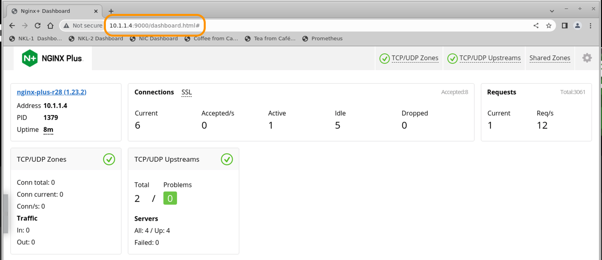
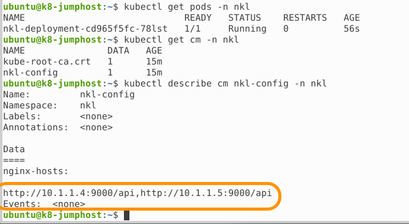
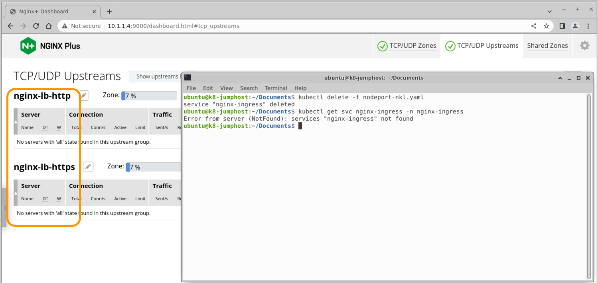
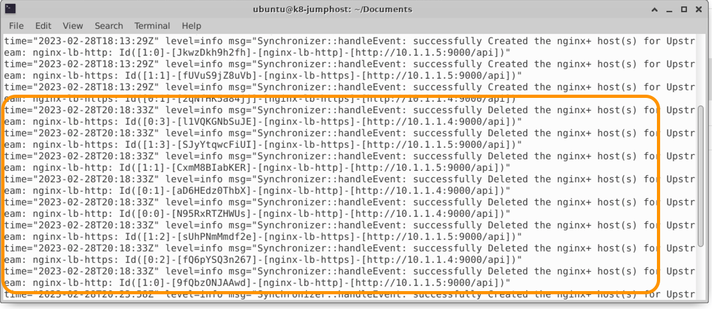

# NGINX Kubernetes Loadbalancer Solution

<br/>

## This is the `TCP Installation Guide` for the NGINX Kubernetes Loadbalancer Controller Solution.  It contains detailed instructions for implementing the different components for the Solution.

<br/>

 |  |  | 
--- | --- | --- | ---

<br/>

## Solution Overview

### This Solution from NGINX provides Enterprise class features which address common challenges with networking, traffic management, and High Availability for On-Premises Kubernetes Clusters.

- Provides a `replacement Loadbalancer Service.`  The Loadbalancer Service is a key component provided by most Cloud Providers.  However, when running a K8s Cluster On Premises, the `Loadbalancer Service is not available`.  
- This Solution provides a replacement, using an NGINX Server, and a new K8s Controller.  These two components work together to watch the NodePort Service in the cluster, and immediately update the NGINX LB Server when changes occur.  No more static `ExternalIP` required in your `loadbalancer.yaml` Manifests!
- Provides automatic NGINX upstream config updates, application health checks, and enhanced metrics.

<br/>


<br/>

## Installation Steps

1. Install NGINX Ingress Controller in your Cluster
2. Install NGINX Cafe Demo Application
3. Install NGINX Plus on the Loadbalancing Server 
4. Install NKL - NGINX Kubernetes LB Controller in your Cluster
5. Test out NKL
6. Optional - Monitor traffic with Prometheus / Grafana

<br/>

### Pre-Requisites

- Working kubernetes cluster, with admin privleges
- Running nginx-ingress controller, either OSS or Plus. This install guide followed the instructions for deploying an NGINX Ingress Controller here:  https://docs.nginx.com/nginx-ingress-controller/installation/installation-with-manifests/
- Demo application, this install guide uses the NGINX Cafe example, found here:  https://github.com/nginxinc/kubernetes-ingress/tree/main/examples/ingress-resources/complete-example
- A bare metal Linux server or VM for the external LB Server, connected to a network external to the cluster.  Two of these will be required if High Availability is needed, as shown here.
- NGINX Plus software loaded on the LB Server(s). This install guide follows the instructions for installing NGINX Plus on Centos 7, located here: https://docs.nginx.com/nginx/admin-guide/installing-nginx/installing-nginx-plus/
- The NGINX Kubernetes Loadbalancer (NKL) Controller, new software for this Solution.

<br/>

### Kubernetes Cluster

<br/>


<br/>

A standard K8s cluster is all that is required.  There must be enough resources available to run the NGINX Ingress Controller, and the new NGINX Kubernetes Loadbalancer Controller.  You must have administrative access to be able to create the namespace, services, and deployments for this Solution.  This Solution was tested on Kubernetes version 1.23.  Most recent versions => v1.21 should work just fine.

<br/>

# 1. Install NGINX Ingress Controller

<br/>


<br/>

The NGINX Ingress Controller in this Solution is the destination target for traffic (north-south) that is being sent to the cluster.  The installation of the actual Ingress Controller is outside the scope of this installation guide, but we include the links to the docs for your reference.  `The NIC installation must follow the documents exactly as written,` as this Solution refers to the `nginx-ingress` namespace and service objects.  **Only the very last step is changed.**  

NOTE: This Solution only works with nginx-ingress from NGINX.  It will not work with the Community version of Ingress, called ingress-nginx.  

If you are unsure which Ingress Controller you are running, check out the blog on nginx.com:  
https://www.nginx.com/blog/guide-to-choosing-ingress-controller-part-4-nginx-ingress-controller-options


>Important!  The very last step in the NIC deployment with Manifests, is to deploy the nodeport.yaml Service file.  `This file must be changed!  It is not the default nodeport file.`  Instead, use the `nodeport-nkl.yaml` manifest file that is provided here with this Solution.  The "ports name" in the Nodeport manifest `MUST` be in the correct format for this Solution to work correctly.  The port name is the mapping from NodePorts to the LB Server's upstream blocks.  The port names are intentionally changed to avoid conflicts with other NodePort definitions.

Review the new `nkl-nodeport.yaml` Service defintion file:

```yaml
# NKL Nodeport Service file
# NodePort port name must be in the format of
# nkl-<upstream-block-name>
# Chris Akker, Apr 2023
#
apiVersion: v1
kind: Service
metadata:
  name: nginx-ingress
  namespace: nginx-ingress
spec:
  type: NodePort 
  ports:
  - port: 80
    targetPort: 80
    protocol: TCP
    name: nkl-nginx-lb-http   # Must be changed to this
  - port: 443
    targetPort: 443
    protocol: TCP
    name: nkl-nginx-lb-https   # Must be changed to this
  selector:
    app: nginx-ingress

```

Apply the updated nodeport-nkl.yaml Manifest:

```bash
kubectl apply -f nodeport-nkl.yaml
```

Verify the NodePort is now defined:

```bash
kubectl get svc nginx-ingress -n nginx-ingress
```


<br/>

## 2. Install NGINX Ingress Demo Application

<br/>


<br/>

This is not part of the actual Solution, but it is useful to have a well-known application running in the cluster, as a known-good target for test commands.  The example provided here is used by the Solution to demonstrate proper traffic flows.  

Note: If you choose a different Application to test with, `the NGINX health checks provided here will likely NOT work,` and will need to be modified to work correctly.

- Use the provided Cafe Demo manifests in the cafe-demo folder:

  ```bash
  kubectl apply -f cafe-secret.yaml
  kubectl apply -f cafe.yaml
  kubectl apply -f cafe-virtualserver.yaml
  ```

- The Cafe Demo reference files are located here:

  https://github.com/nginxinc/kubernetes-ingress/tree/main/examples/ingress-resources/complete-example

- The Cafe Demo Docker image used is an upgraded one, with simple graphics and additional Request and Response variables added.

  https://hub.docker.com/r/nginxinc/ingress-demo

**IMPORTANT** - Do not use the `cafe-ingress.yaml` file.  Rather, use the `cafe-virtualserver.yaml` file that is provided here.  It uses the NGINX Plus CRDs to define a VirtualServer, and the related Virtual Server Routes needed.  If you are using NGINX OSS Ingress Controller, you will need to comment out the healthcheck parameters.

<br/>

# 3. Install NGINX Plus on LoadBalancer Server

<br/>

### Linux VM or bare-metal LB Server

 | 
--- | ---

This is any standard Linux OS system, based on the Linux Distro and Technical Specs required for NGINX Plus, which can be found here: https://docs.nginx.com/nginx/technical-specs/   

This Solution followed the `Installation of NGINX Plus on Centos/Redhat/Oracle` steps for installing NGINX Plus.  

>NOTE:  This solution will only work with NGINX Plus, as NGINX OpenSource does not have the API that is used in this Solution.  Installation on unsupported Distros is not recommended.

<br/>

## NGINX Plus Configuration

This is the configuration required for the LB Server, external to the cluster.  It must be configured for the following.

- Move the NGINX default Welcome page from port 80 to port 8080.  Port 80 will be used by the stream context, instead of the http context.
- API write access enabled on port 9000.
- Plus Dashboard enabled, used for testing, monitoring, and visualization of the Solution working.
- The `Stream` context is enabled, for TCP loadbalancing.
- Stream context is configured.

After the new installation of NGINX Plus, make the following configuration changes:

- Change NGINX's http default server to port 8080.  See the included `default.conf` file.  After reloading NGINX, the default `Welcome to NGINX` page will be located at http://localhost:8080.

```bash
cat /etc/nginx/conf.d/default.conf
# NGINX K8s Loadbalancer Solution
# Chris Akker, Apr 2023
# Example default.conf
# Change default_server to port 8080
#
server {
    listen       8080 default_server;   # Changed to 8080
    server_name  localhost;

    #access_log  /var/log/nginx/host.access.log  main;

    location / {
        root   /usr/share/nginx/html;
        index  index.html index.htm;
    }

    #error_page  404              /404.html;

    # redirect server error pages to the static page /50x.html
    #
    error_page   500 502 503 504  /50x.html;
    location = /50x.html {
        root   /usr/share/nginx/html;
    }

### other sections removed for clarity

}

```

- Use the dashboard.conf file provided.  It will enable the /api endpoint, change the port to 9000, and provide access to the Plus Dashboard.  Place this file in the /etc/nginx/conf.d folder, and reload NGINX.  The Plus dashboard is now accessible at http://nginx-lb-server-ip:9000/dashboard.html.  It should look similar to this:



- Create a new folder for the stream config .conf files.  `/etc/nginx/stream` is used in this Solution.

```bash
mkdir /etc/nginx/stream
```

- Create 2 new `STATE` files for NGINX.  These are used to backup the Upstream configuration, in case NGINX is restarted/reloaded.

  NGINX State Files Required for Upstreams
    - state file /var/lib/nginx/state/nginx-lb-http.state
    - state file /var/lib/nginx/state/nginx-lb-https.state

```bash
touch /var/lib/nginx/state/nginx-lb-http.state
touch /var/lib/nginx/state/nginx-lp-https.state
```

- Enable the `stream` context for NGINX, which provides TCP load balancing.  See the included nginx.conf file.  Notice that the stream context is no longer commented out, the new folder is included, and a new stream.log logfile is used to track requests/responses.

```bash
cat /etc/nginx/nginx.conf

# NGINX K8s Loadbalancer Solution
# Chris Akker, Apr 2023
# Example nginx.conf
# Enable Stream context, add /var/log/nginx/stream.log
#

user  nginx;
worker_processes  auto;

error_log  /var/log/nginx/error.log notice;
pid        /var/run/nginx.pid;

events {
    worker_connections  1024;
}

http {
    include       /etc/nginx/mime.types;
    default_type  application/octet-stream;

    log_format  main  '$remote_addr - $remote_user [$time_local] "$request" '
                      '$status $body_bytes_sent "$http_referer" '
                      '"$http_user_agent" "$http_x_forwarded_for"';

    access_log  /var/log/nginx/access.log  main;

    sendfile        on;
    #tcp_nopush     on;

    keepalive_timeout  65;

    #gzip  on;

    include /etc/nginx/conf.d/*.conf;
}

# TCP/UDP proxy and load balancing block
#
stream {
    # Example configuration for TCP load balancing

    #upstream stream_backend {
    #    zone tcp_servers 64k;
    #    server backend1.example.com:12345;
    #    server backend2.example.com:12345;
    #}

    #server {
    #    listen 12345;
    #    status_zone tcp_server;
    #    proxy_pass stream_backend;

    include  /etc/nginx/stream/*.conf;

    log_format  stream  '$remote_addr - $server_addr [$time_local] $status $upstream_addr $upstream_bytes_sent';

    access_log  /var/log/nginx/stream.log  stream;
}

```

- Configure NGINX Stream for TCP loadbalancing for this Solution.

  `Notice that is uses Ports 80 and 443.`  
  
  Place this file in the /etc/nginx/stream folder, and reload NGINX.  Notice the match block and health check directives are for the cafe.example.com Demo application from NGINX.

```bash
# NGINX K8sLB Stream configuration, for L4 load balancing
# Chris Akker, Apr 2023
# TCP Proxy and load balancing block
# NGINX Kubernetes Loadbalancer
# State File for persistent reloads/restarts
# Health Check Match example for cafe.example.com
#
#### nginxk8slb.conf

   upstream nginx-lb-http {
      zone nginx-lb-http 256k;
      state /var/lib/nginx/state/nginx-lb-http.state; 
    }

   upstream nginx-lb-https {
      zone nginx-lb-https 256k;
      state /var/lib/nginx/state/nginx-lb-https.state; 
    }

   server {
      listen 80;
      status_zone nginx-lb-http;
      proxy_pass nginx-lb-http;
      health_check match=cafe;
    }
             
   server {
      listen 443;
      status_zone nginx-lb-https;
      proxy_pass nginx-lb-https;
      health_check match=cafe;
    }

   match cafe {
      send "GET cafe.example.com/ HTTP/1.0\r\n";
      expect ~ "30*";
    }

```

<br/>

## 4. Install NKL - NGINX Kubernetes Loadbalancing Controller

<br/>


<br/>

This is the new Controller, which is configured to watch the K8s environment, the `nginx-ingress Service` object, and send API updates to the NGINX LB Server when there are changes.  It only requires three things.

- New kubernetes namespace and RBAC
- NKL ConfigMap, to configure the Controller
- NKL Deployment, to deploy and run the Controller

Create the new K8s namespace:

```bash
kubectl create namespace nkl
```

Apply the manifests for Secret, Service, ClusterRole, and ClusterRoleBinding:

```bash
kubectl apply -f secret.yaml serviceaccount.yaml clusterrole.yaml clusterrolebinding.yaml
```

Modify the ConfigMap manifest to match your Network environment. Change the `nginx-hosts` IP address to match your NGINX LB Server IP.  If you have 2 or more LB Servers, separate them with a comma.  Keep the port number for the Plus API endpoint, and the `/api` URL as shown.

```yaml

apiVersion: v1
kind: ConfigMap
data:
  nginx-hosts:
    "http://10.1.1.4:9000/api,http://10.1.1.5:9000/api" # change IP(s) to match NGINX LB Server(s)
metadata:
  name: nkl-config
  namespace: nkl

```

Apply the updated ConfigMap:

```bash
kubectl apply -f nkl-configmap.yaml
```

Deploy the NKL Controller:

```bash
kubectl apply -f nkl-deployment.yaml
```

Check to see if the NKL Controller is running with the updated ConfigMap:

```bash
kubectl get pods -n nkl
```
```bash
kubectl describe cm nkl-config -n nkl
```

The status should show "running", your nginx-hosts should have the LB Server IP:Port/api.



To make it easy to watch the NKL controller log messages, add the following bash alias:

```bash
alias nkl-follow-logs='kubectl -n nkl get pods | grep nkl-deployment | cut -f1 -d" "  | xargs kubectl logs -n nkl --follow $1'
```

Using a Terminal, watch the NKL Controller logs:

```bash
nkl-follow-logs
```

Leave this Terminal window open, so you can watch the log messages!

Create the NKL compatible NODEPORT Service, using the `nodeport-nkl.yaml` manifest provided:

```bash
kubectl apply -f nodeport-nkl.yaml
```

Verify that the `nginx-ingress` NodePort Service is properly defined:

```bash
kubectl get svc nginx-ingress -n nginx-ingress
```


<br/>

## 4. Testing NKL

<br/>


When you are finished, the NGINX Plus Dashboard on the LB Server should look similar to the following image:


Important items for reference:
- Orange are the upstream server blocks, from the `etc/nginx/stream/nginxk8slb.conf` file.
- Blue is the IP:Port of the NodePort Service for http.
- Indigo is the IP:Port of the NodePort Service for https.

>Note: In this example, there is a 3-Node K8s cluster, with one Control Node, and 2 Worker Nodes.  The NKL Controller only configures `Worker Node` IP addresses, which are:
- 10.1.1.8
- 10.1.1.10

Note:  K8s Control Nodes are excluded intentionally.

<br/>

Configure DNS, or your local hosts file, for cafe.example.com > NGINXLB Server IP Address.  In this example:

```bash
cat /etc/hosts
10.1.1.4 cafe.example.com
```

- Open a browser tab to cafe.example.com.  It should redirect to https://cafe.example.com/coffee.

The Dashboard's `TCP/UDP Upstreams Connection counters` will increase as you refresh the browser page several times.

- Using a Terminal, delete the `nginx-ingress nodeport service` definition.  

```bash
kubectl delete -f nodeport-nkl.yaml
```

Now the `nginx-ingress` Service is gone, and the upstream list will be empty in the Dashboard.



The NKL log messages confirm the deletion of the NodePorts:



- If you refresh the cafe.example.com browser page, it will Time Out.  There are NO upstreams for NGINX to send the request to!

---

- Add the `nginx-ingress` Service back to the cluster:

```
kubectl apply -f nodeport-nkl.yaml
```

- Verify the nginx-ingress Service is re-created.  Notice the the Port Numbers have changed !

`The NKL Controller detects this change, and modifies the upstreams.`  The Dashboard will show you the new Port numbers, matching the new NodePort definitions.  The NKL logs show these messages, confirming the changes:


<br/>

This Completes the Testing Section.

<br/>

## Authors
- Chris Akker - Solutions Architect - Community and Alliances @ F5, Inc.
- Steve Wagner - Solutions Architect - Community and Alliances @ F5, Inc.
